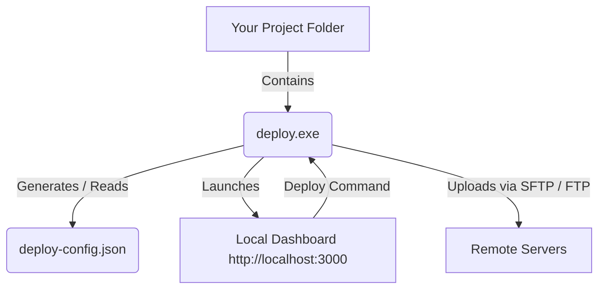

# 🚀 FTP Deployment Manager

The **FTP Deployment Manager** is a standalone, lightweight, web-based tool designed to easily synchronize local project files and directories to remote servers via FTP or SFTP. 

Once compiled into a standalone executable (`deploy.exe`), you can drop it into any project folder. Running it launches a local dashboard that allows you to manage server credentials, map files and folders, and deploy them with real-time feedback.

---

## 🛠️ How It Works

This tool is designed to run in a portable fashion directly inside the project directory you want to deploy:

1. **Standalone Executable**: The project uses `pkg` to package the Node.js runtime, Express backend, and Frontend HTML/JS into a single binary (`deploy.exe`).
2. **Local Server & UI**: Running `deploy.exe` starts a local server on port `3000` and automatically opens a browser dashboard.
3. **Project Context**: The executable uses its current working directory (CWD) as the source path for files, making it fully portable. You configure credentials and file mappings, which are saved locally in a `deploy-config.json` file inside your project.



---

## 📦 Building the Executable

To compile the standalone `deploy.exe` file:

1. Clone or copy the project files to your local environment.
2. Install the build dependencies:
   ```bash
   npm install
   ```
3. Run the packaging script:
   ```bash
   npm run build-exe
   ```

This generates a standalone `deploy.exe` binary in the root directory.

---

## 🚀 How to Use the Executable

1. **Copy** the generated `deploy.exe` file and drop it into the root of any project you want to manage deployments for.
2. **Double-click** `deploy.exe` (or run it via cmd/powershell).
3. A local server will start and open `http://localhost:3000` in your web browser.
4. **Configure Mappings & Servers**:
   - Add your remote FTP or SFTP connection credentials.
   - Select the files/folders in your project you want to map to remote directories.
5. **Deploy**: Select your target server, choose the mappings you want to upload, and click **Deploy** to stream the logs and watch the upload in real time.

---

## 📝 Saved Configurations (`deploy-config.json`)

Your server configurations and file mappings are saved inside the target project directory under `deploy-config.json`:

```json
{
  "servers": [
    {
      "host": "example.sftp.wpengine.com",
      "protocol": "sftp",
      "port": 2222,
      "user": "sftp-username",
      "password": "securepassword",
      "remotePath": "/wp-content/plugins/my-plugin/"
    }
  ],
  "deployments": [
    {
      "type": "file",
      "local": "index.html",
      "remote": "/index.html"
    },
    {
      "type": "directory",
      "local": "dist",
      "remote": "dist"
    }
  ]
}
```
> [!WARNING]
> Keep your `deploy-config.json` secure and add it to your project's `.gitignore` file to ensure you don't accidentally commit server passwords.
