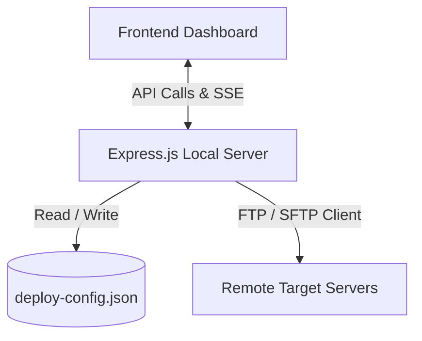

# 🚀 Portside (FTP/SFTP Deployment Manager)

Portside is a modern, lightweight, web-based deployment manager designed to easily synchronize local project files and directories to remote servers via FTP or SFTP. 

It provides an intuitive web interface to manage server configurations, specify deployment mappings, and stream real-time logs during the deployment process.

---

## ✨ Features

- **Multi-Protocol Support**: Deploy files securely via **SFTP** or standard **FTP**.
- **Real-Time Deployment Logs**: Watch your deployment progress file-by-file with live-streaming updates.
- **Directory & File Mappings**: Configure exactly which local files/folders map to which remote destinations.
- **Workspace File Scanner**: Browse and select local files/directories directly within the app interface.
- **Server Profiles**: Store multiple target server configurations (development, staging, production) and deploy to one or many simultaneously.

---

## 🛠️ How It Works

Portside runs as a local lightweight backend server (Express.js) that hosts the frontend control panel and coordinates the file transfer protocols.



### 1. The Configuration (`deploy-config.json`)
The application stores server credentials and target mappings in a local JSON config file:
- **`servers`**: Defines server connections (host, user, port, protocol, destination folder).
- **`deployments`**: Specifies which local paths (files or directories) should map to which remote destinations.

### 2. The Deployment Pipeline
- When you click **Deploy**, the frontend issues a `POST` request to `/api/deploy`.
- The Express server connects to each selected remote server sequentially.
- Using active FTP/SFTP clients, the server automatically creates any missing directory paths on the remote end and uploads files.
- Log events are continuously sent back using chunked HTTP transfer streaming, so you see exactly what's happening live.

---

## 🚀 Getting Started

### Prerequisites
- [Node.js](https://nodejs.org/) (v16 or higher recommended)

### Installation

1. Clone or copy the project files to your computer.
2. Install the necessary dependencies:
   ```bash
   npm install
   ```

### Running the App

Start the local development server:
```bash
npm start
```
The application will automatically start running at `http://localhost:3000` and open in your default browser.

---

## 📝 Configuration Schema

The config structure is defined as follows:

```json
{
  "servers": [
    {
      "host": "example.sftp.wpengine.com",
      "protocol": "sftp",
      "port": 2222,
      "user": "sftp-username",
      "password": "securepassword",
      "remotePath": "/wp-content/plugins/my-plugin/"
    }
  ],
  "deployments": [
    {
      "type": "file",
      "local": "index.html",
      "remote": "/index.html"
    },
    {
      "type": "directory",
      "local": "dist",
      "remote": "dist"
    }
  ]
}
```
